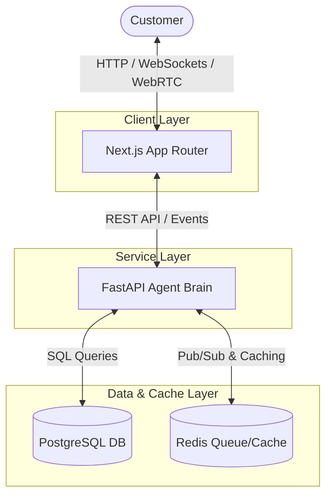

# Multimodal Autonomous Customer Support Agent

A unified, state-of-the-art autonomous agent brain designed to streamline customer support operations across multiple communication channels. The agent, named **Aura**, exposes a shared cognitive loop allowing customers to interact seamlessly via text chat and phone voice.

## One-Line Architecture

The system coordinates a Next.js (TypeScript/Tailwind CSS) frontend, a Python FastAPI backend acting as the agent brain, a PostgreSQL persistent database, and a Redis event queue/cache, fully containerized using Docker Compose.

---

## Architecture Diagram



---

## Features

- **Omnichannel Interaction:** Converse via live text chat or voice calls seamlessly backed by the same agent context.
- **Unified Brain State:** Agent memory, context, and reasoning paths are maintained centrally and shared across all user channels.
- **Real-Time Logs:** View the agent's internal thoughts (Perception, Reasoning, Action) as it responds.

---

## Project Structure

```text
├── .github/workflows/  # GitHub Actions CI Configurations
├── backend/            # FastAPI Python 3.12 Backend
├── docs/               # System Architecture and API Documentation
├── frontend/           # Next.js 15 (App Router, TS, Tailwind CSS) Frontend
├── infra/              # Infrastructure Configuration Documentation
├── docker-compose.yml  # Local Container Orchestration Configuration
└── .env.example        # Reference Configuration Template
```

---

## How to Run Locally

### Prerequisites

Make sure you have [Docker](https://www.docker.com/) and [Docker Compose](https://docs.docker.com/compose/) installed on your machine.

### Getting Started

1. **Clone the Repository:**
   ```bash
   git clone https://github.com/PushpakBajanghate/Multimodal-Autonomous-Customer-Support-Agent.git
   cd Multimodal-Autonomous-Customer-Support-Agent
   ```

2. **Configure Environment Variables:**
   Copy the example environment configuration:
   ```bash
   cp .env.example .env
   ```
   *(Windows Powershell equivalent: `copy .env.example .env`)*

3. **Build and Run with Docker Compose:**
   Run the following command to build the Docker images and start the services:
   ```bash
   docker-compose up --build
   ```

4. **Verify Health:**
   Once running, you can access the services at:
   - **Frontend:** [http://localhost:3000](http://localhost:3000)
   - **Backend Health Check:** [http://localhost:8000/health](http://localhost:8000/health)
   - **Interactive API Docs:** [http://localhost:8000/docs](http://localhost:8000/docs)
