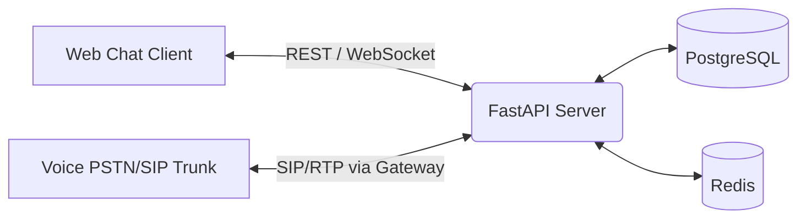

# System Architecture & API Documentation

This document covers the architectural details and API design for the **Multimodal Autonomous Customer Support Agent**.

---

## 1. System Components



### Next.js Frontend
- **Framework:** Next.js 15 (App Router) + TypeScript + Tailwind CSS.
- **Role:** Interactive UI offering client text-chat simulation, voice call control (PSTN simulation), and visual feedback of the agent's internal thought logs.
- **Port:** `3000`

### FastAPI Backend
- **Framework:** Python 3.12 + FastAPI.
- **Role:** Autonomous agent brain orchestrating LLM tool calling, memory management, and streaming real-time thoughts to clients.
- **Port:** `8000`

### PostgreSQL
- **Role:** Relational persistent storage for customer accounts, chat histories, session transcriptions, and agent profiles.
- **Port:** `5432`

### Redis
- **Role:** Fast cache, temporary session storage, and event-driven message broker (Pub/Sub) for real-time WebSockets and task queues.
- **Port:** `6379`

---

## 2. API Specifications

### System Routes

#### Health Check
- **Endpoint:** `GET /health`
- **Description:** Verifies that the FastAPI backend is online and configured properly.
- **Response Format:**
  ```json
  {
    "status": "healthy",
    "project": "Multimodal Autonomous Customer Support Agent"
  }
  ```

---

## 3. Communication Channels

### Text Chat
- High-performance WebSocket stream or simple HTTP POST polling for dispatching user statements and retrieving agent outputs asynchronously.

### Voice Support (PSTN / VoIP)
- Designed to integrate with VoIP gateways (e.g. Twilio Voice, LiveKit, or custom Asterisk SIP trunks).
- Text-to-Speech (TTS) and Speech-to-Text (STT) run in the backend pipelines to process incoming audio packets and synthesize voice responses in real time.
