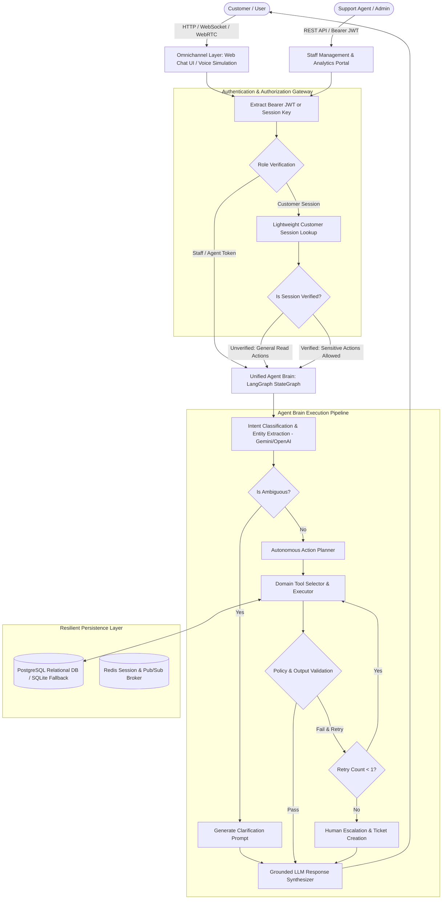
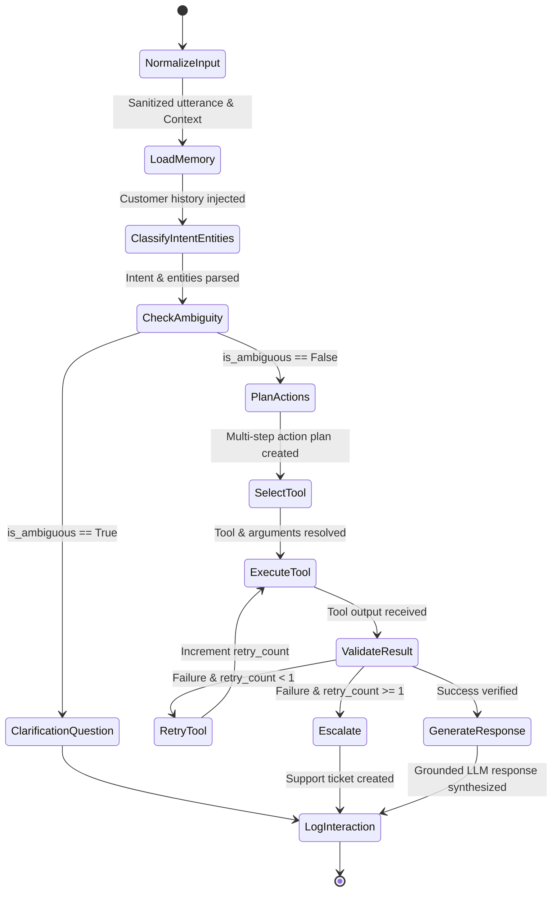
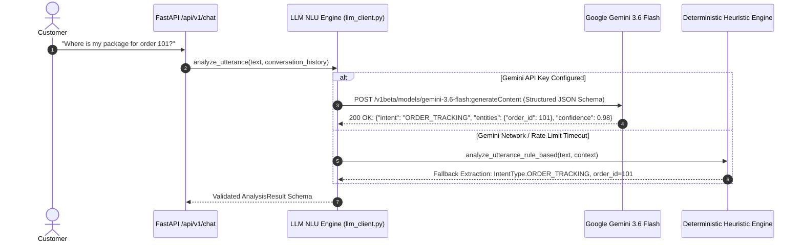
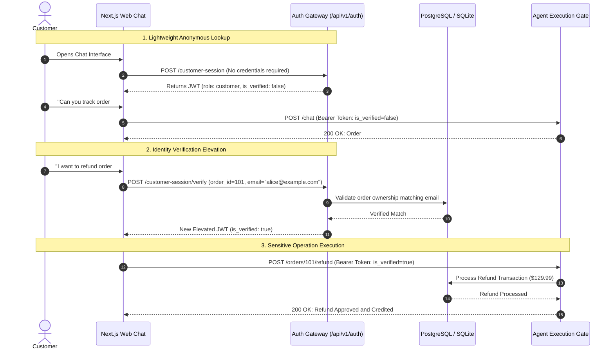
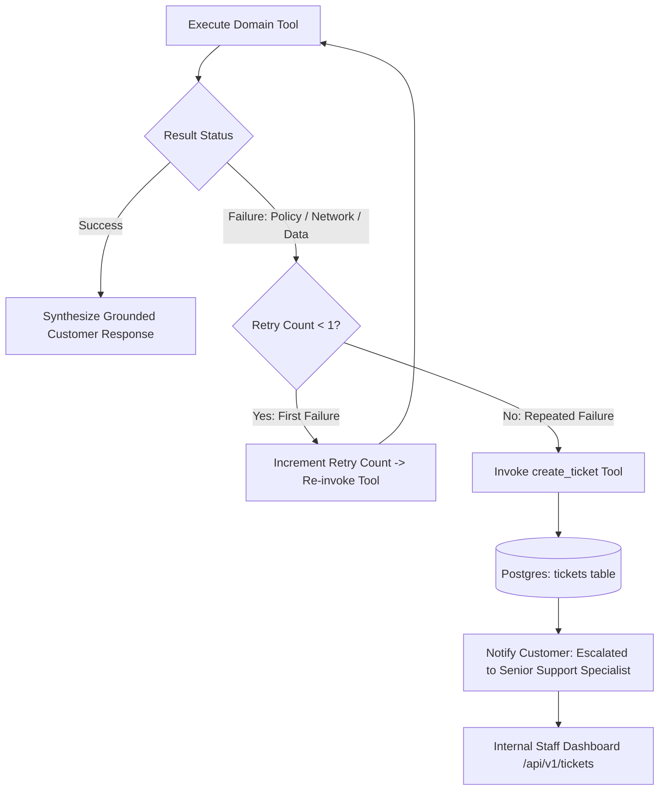

# Multimodal Autonomous Customer Support Agent (Aura) — System Flow & Execution Architecture

This document provides a comprehensive end-to-end technical reference for the execution flows, state machine lifecycle, decision routing, multimodal channel interaction, and security gates of the **Aura** customer support platform.

---

## 1. High-Level System Architecture & Flow



---

## 2. Autonomous Agent Brain: LangGraph State Machine Lifecycle

The agent brain is modeled as a compiled LangGraph `StateGraph` consisting of 10 discrete nodes and deterministic conditional branching logic:



### LangGraph State Nodes Reference

| Node Name | Purpose | Output Mutation |
| :--- | :--- | :--- |
| `normalize_input` | Strips whitespace, sanitizes control characters | `normalized_input`, `trajectory` |
| `load_memory` | Loads customer profile, order history, and active conversation state | `customer_context`, `trajectory` |
| `classify_intent_entities` | Invokes Gemini 3.6 Flash / OpenAI structured JSON extraction | `intent`, `intent_confidence`, `entities`, `is_ambiguous` |
| `check_ambiguity` | Evaluates missing critical slots (e.g., missing Order ID for refund) | `trajectory` |
| `clarification_question` | Crafts a polite question requesting specific missing parameters | `final_response`, `trajectory` |
| `plan_actions` | Builds an explicit step-by-step resolution plan | `plan`, `trajectory` |
| `select_tool` | Maps intent and parameters to domain tool (`TOOL_REGISTRY`) | `selected_tool`, `tool_args`, `trajectory` |
| `execute_tool` | Invokes domain service via isolated Phase 2 API layer | `tool_results`, `tool_status`, `trajectory` |
| `validate_result` | Verifies tool output against business policies; detects failure | `needs_retry`, `needs_escalation`, `risk_score` |
| `retry_tool` | Bounded automatic retry loop (max 1 retry) | `retry_count += 1`, `needs_retry = False` |
| `escalate` | Dispatches incident to human staff queue with automatic ticket | `final_response`, `trajectory` |
| `generate_response` | Synthesizes grounded, empathetic customer reply | `final_response`, `trajectory` |
| `log_interaction` | Records interaction logs, token usage, and trajectory metrics | `trajectory` |

---

## 3. Natural Language Understanding (NLU) Pipeline



---

## 4. Authentication & Authorization Lifecycle



---

## 5. Bounded Retry & Human Escalation Matrix



---

## 6. Omnichannel Architecture (Web Chat & Voice Simulation)

```mermaid
flowchart LR
    subgraph Channels [Omnichannel Ingestion]
        WebChat[Next.js Web Chat UI]
        VoiceSim[Voice Audio Stream / Simulated WebRTC]
    end

    subgraph AudioProcessing [Speech Processing Pipeline]
        STT[Speech-to-Text: Whisper / Gemini Audio API]
        TTS[Text-to-Speech: ElevenLabs / Web Speech Synthesis]
    end

    VoiceSim --> STT --> CoreAPI
    WebChat --> CoreAPI[FastAPI Agent Ingestion Gateway]
    CoreAPI --> StateGraph[LangGraph State Machine Engine]
    StateGraph --> GroundedGen[Grounded LLM Generator]
    GroundedGen --> WebChat
    GroundedGen --> TTS --> VoiceSim